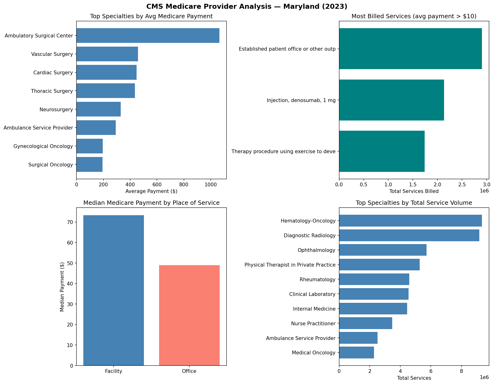
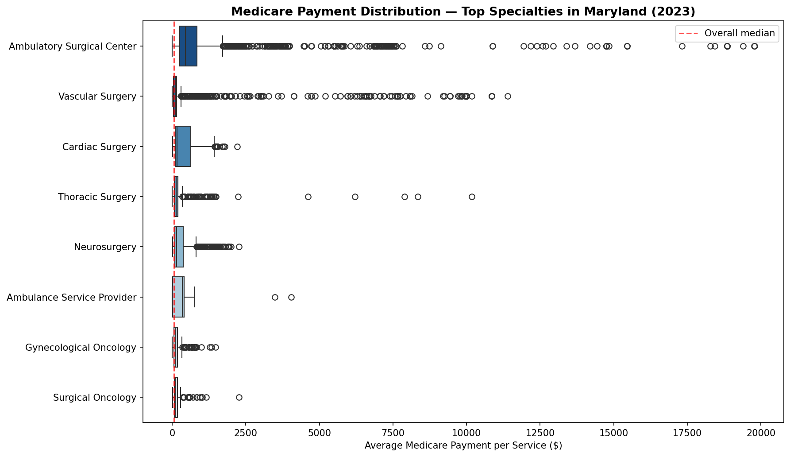

# cms-medicare-sql-analysis
SQL and Python analysis of Medicare provider utilization data using CMS public datasets
# CMS Medicare Provider Utilization — SQL & Python Analysis

## Overview
SQL and Python analysis of Medicare provider billing patterns in Maryland
using the CMS Medicare Physician & Other Practitioners dataset (2023).
This project demonstrates a full data pipeline: raw CSV ingestion, pandas
cleaning, SQLite database creation, SQL querying, and visualization.

## Data Source
[CMS Medicare Physician & Other Practitioners by Provider and Service (2023)](https://data.cms.gov/provider-summary-by-type-of-service/medicare-physician-other-practitioners/medicare-physician-other-practitioners-by-provider-and-service)  
Filtered to Maryland providers | n = 223,406 records

## Tools & Languages
- **Python** — pandas, matplotlib, seaborn (cleaning & visualization)
- **SQL** — SQLite (database creation & querying)

## Repository Structure
- `01_cms_data_analysis.ipynb` — full analysis notebook
- `results/` — all generated figures

## Results

### Provider & Specialty Overview

### Payment Distribution by Specialty

## Key Findings

**Ambulatory Surgical Centers have the highest average Medicare payment**
at $1,064 per service — more than double Vascular Surgery ($458), reflecting
the high procedural costs of facility-based outpatient surgery.

**Established patient office visits are the most frequently billed service**
with nearly 3 million claims, consistent with primary care being the backbone
of outpatient Medicare utilization.

**Facility-based services receive ~50% higher median payments than
office-based services** ($74 vs $49), reflecting Medicare's site-of-service
payment differentials.

**Hematology-Oncology and Diagnostic Radiology lead total service volume**
in Maryland, consistent with the concentration of major academic medical
centers including Johns Hopkins and University of Maryland in the state.

## Author
Simran Randhawa | MS Student, Johns Hopkins Bloomberg School of Public Health  
[LinkedIn](www.linkedin.com/in/simranrandhawa20)
